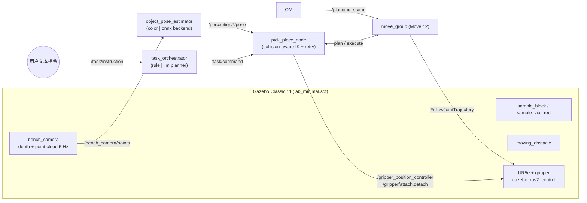

# robot_lab_demo

Simulation demo for the lab collaborative robot competition scenario
(面向实验室智能管理的协作机器人环境感知与动作规划方法研究).
It combines the installed Universal Robots ROS 2 packages with a
project-specific robot (UR5e on a pedestal with a parallel two-finger
gripper), a Gazebo lab world with manipulable objects, and task nodes that
perform a real grasp-transport-place cycle.

## Architecture



## What It Runs

- Gazebo Classic 11 world with a lab workbench, sample block, red sample vial,
  sample tray, tool caddy, and target pad.
- Project robot description `lab_ur_gripper.urdf.xacro`: UR5e on a 0.76 m
  pedestal column with a parallel gripper, simulated through
  `gazebo_ros2_control`.
- Gazebo Classic publishes `/bench_camera/image`, `/bench_camera/depth/*`, and
  `/bench_camera/points` directly through `libgazebo_ros_camera.so`.
- MoveIt 2 (`move_group` started directly with the stock `ur_moveit_config`
  pipeline configs and a project SRDF that adds the gripper semantics).
- RViz with the MoveIt planning interface.
- `scripted_pick_demo`: a full pick-and-place cycle — open gripper, approach,
  descend, close fingers, attach, lift, transfer, place, detach, retreat.
- `preset_joint_demo`: the original joint-space smoke-test motion.
- Overhead RGB-D camera (`/bench_camera/*` topics) + `robot_lab_perception`:
  color/point-cloud object detection publishing 6D poses on
  `/perception/<object>/pose`, RViz markers, and a JSON summary on
  `/perception/detections`. The detector backend is pluggable (`color`
  default; `onnx` integration point for deep-learning models).
- Task layer: `task_orchestrator` decomposes natural-language instructions
  (Chinese/English) from `/task/instruction` into atomic actions and
  dispatches them sequentially; `pick_place_node` executes perception-driven
  pick/place with collision-aware IK and abort-replan retries;
  `obstacle_monitor` mirrors the moving obstacle into the MoveIt planning
  scene in real time (~0.3 ms update latency).

## Text-Command Operation

With the demo running:

```bash
ros2 topic pub --once /task/instruction std_msgs/msg/String "{data: '把样品块放到目标垫'}"
ros2 topic pub --once /task/instruction std_msgs/msg/String "{data: '先把试管瓶放到托盘，然后把样品块放到中间'}"
```

Vocabulary: objects = 样品块/方块/block, 试管瓶/瓶/vial; targets = 目标垫/垫/pad,
托盘/tray, 中间/center. Progress is reported on `/task/plan` and `/task/status`.

## Evaluation Benchmarks

```bash
# Perception accuracy (writes results/perception_eval.csv)
ros2 run robot_lab_perception evaluate_perception --ros-args -p trials:=20
# Pick/place success rate (writes results/pick_place_eval.csv)
ros2 run robot_lab_tasks evaluate_pick_place.py --ros-args -p trials:=5
# With intermittent dynamic-obstacle interference
ros2 run robot_lab_tasks evaluate_pick_place.py --ros-args -p trials:=3 -p sweep_obstacle:=true
```

Measured baselines (WSL2, headless):
- Perception: 20/20 detected (100%), mean planar error 2.5 mm, max 5.8 mm.
- Pick/place: 5/5 succeeded (100%) clean; 3/3 (100%) under obstacle
  interference with abort-replan retries.
- Obstacle pose -> planning scene latency: mean 0.32 ms, max 1.68 ms
  (results/obstacle_latency.csv).

## Build

```bash
cd /home/THW22/projects/robot_lab_demo
source /opt/ros/humble/setup.bash
colcon build --symlink-install
source install/setup.bash
```

## Launch The Lab Demo

```bash
ros2 launch robot_lab_bringup lab_ur_moveit_gz.launch.py
```

The default launch profile is WSLg-stable: Gazebo runs headless, RViz uses the
lightweight `robot_lab_stable.rviz` view, and perception/task nodes are off.

Useful launch options:

```bash
ros2 launch robot_lab_bringup lab_ur_moveit_gz.launch.py ur_type:=ur5e
ros2 launch robot_lab_bringup lab_ur_moveit_gz.launch.py gazebo_gui:=false launch_rviz:=false
ros2 launch robot_lab_bringup lab_ur_moveit_gz.launch.py auto_start_task:=true
ros2 launch robot_lab_bringup lab_ur_moveit_gz.launch.py rviz_profile:=moveit
ros2 launch robot_lab_bringup lab_ur_moveit_gz.launch.py render_mode:=gpu
ros2 launch robot_lab_bringup lab_ur_moveit_gz.launch.py qt_gl_integration:=xcb_glx
ros2 launch robot_lab_bringup lab_ur_moveit_gz.launch.py window_backend:=wayland
```

On WSLg, keep Gazebo GUI disabled for stable runs:

```bash
ros2 launch robot_lab_bringup lab_ur_moveit_gz.launch.py \
  gazebo_gui:=false launch_rviz:=true rviz_profile:=stable \
  launch_tasks:=false launch_perception:=false
```

The launch file uses a stable WSLg software OpenGL path for RViz and Gazebo:
`QT_QPA_PLATFORM=xcb`, `QT_OPENGL=software`, `LIBGL_ALWAYS_SOFTWARE=1`,
`QT_X11_NO_MITSHM=1`, and a private `XDG_RUNTIME_DIR` under `/tmp`.
Use `render_mode:=gpu` to switch to Mesa D3D12 acceleration
(`QT_OPENGL=desktop`, `GALLIUM_DRIVER=d3d12`, `LIBGL_ALWAYS_SOFTWARE=0`) when
software rendering is too slow.
If GPU rendering flickers, compare `qt_gl_integration:=xcb_egl` and
`qt_gl_integration:=xcb_glx`.
If both XCB integrations flicker, install `qtwayland5` and try
`window_backend:=wayland`.
The `stable` RViz profile intentionally avoids the full MoveIt planning panel,
point cloud display, and camera image display because those are the most common
WSLg crash sources. Use `rviz_profile:=moveit` only after the stable profile is
working.

For larger RViz/Gazebo/rqt controls and cursor under WSLg, this launch file
keeps Qt scale at `gui_scale:=1.0` and raises text DPI to `gui_font_dpi:=144`.
Avoid changing `gui_scale` under WSLg because scaling RViz's OpenGL viewport can
make it flicker.

## Run The Tasks

Open a second terminal after the launch is running:

```bash
cd /home/THW22/projects/robot_lab_demo
source /opt/ros/humble/setup.bash
source install/setup.bash
# Full grasp cycle: pick the sample block and place it on the target pad.
ros2 run robot_lab_tasks scripted_pick_demo
# Joint-space smoke test (no gripper interaction).
ros2 run robot_lab_tasks preset_joint_demo
```

Both nodes use MoveIt group `ur_manipulator`, add a `lab_table` collision
object, plan through `move_group`, and execute on
`joint_trajectory_controller`. The pick node additionally commands the
fingers through `/gripper_position_controller/commands`.

## Verification Commands

```bash
ros2 control list_controllers
ros2 action list | grep follow_joint_trajectory
ros2 node list | grep move_group
ros2 pkg list | grep robot_lab
```

Expected controller signal:

```text
joint_state_broadcaster active
joint_trajectory_controller active
gripper_position_controller active
```

## Files

```text
src/robot_lab_description/worlds/lab_minimal.sdf
src/robot_lab_description/urdf/lab_ur_gripper.urdf.xacro
src/robot_lab_description/urdf/inc/parallel_gripper_macro.xacro
src/robot_lab_description/srdf/lab_ur_gripper.srdf.xacro
src/robot_lab_bringup/config/lab_ur_controllers.yaml
src/robot_lab_bringup/config/robot_lab_moveit.rviz
src/robot_lab_bringup/launch/lab_ur_moveit_gz.launch.py
src/robot_lab_perception/robot_lab_perception/object_pose_estimator.py
src/robot_lab_perception/robot_lab_perception/detector_backends.py
src/robot_lab_perception/robot_lab_perception/evaluate_perception.py
src/robot_lab_tasks/src/pick_place_node.cpp
src/robot_lab_tasks/src/scripted_pick_demo.cpp
src/robot_lab_tasks/src/preset_joint_demo.cpp
src/robot_lab_tasks/scripts/task_orchestrator.py
src/robot_lab_tasks/scripts/obstacle_monitor.py
src/robot_lab_tasks/scripts/evaluate_pick_place.py
```

## Mecanum Mobile Base Variant

`lab_ur_mecanum_gz.launch.py` is still the original Gazebo Sim / ros_gz
mobile-base variant. It is not part of the Humble + Gazebo Classic smoke test.
The fixed UR5e pedestal demo is the supported Humble path in this workspace.

```bash
ros2 launch robot_lab_bringup lab_ur_mecanum_gz.launch.py
# Omnidirectional teleop (forward + strafe + rotate):
ros2 topic pub -r 10 /cmd_vel geometry_msgs/msg/Twist "{linear: {x: 0.3, y: 0.2}, angular: {z: 0.1}}"
# Odometry:
ros2 topic echo /odom
```

Verified: pure-strafe command moves the base sideways with ~0 forward
drift (the mecanum signature); arm controllers stay active on the moving
platform. Autonomous navigation to station_b (odom/world TF wiring + a
base-motion action in the task layer) is the documented next step.

## Current Limitations

- The fixed UR5e pedestal demo is ported to Humble + Gazebo Classic.
- The mecanum mobile-base variant and Gazebo Sim attach/detach grasp plugin
  remain Jazzy/Gazebo Sim oriented and need a separate Classic migration.
- Gazebo Classic does not provide the same `DetachableJoint` system used by
  the Jazzy demo, so object attachment is not enabled in the Classic smoke
  path yet.
- If Gazebo/RViz is slow under WSLg, use `gazebo_gui:=false launch_rviz:=false`
  for headless verification.

## Troubleshooting

If `preset_joint_demo` reports that `robot_description` or `/joint_states` is missing, the bringup launch is not running yet.
Start the full demo first, wait for MoveIt to print `You can start planning now!`, and then run the task node in a second terminal.
For a one-terminal smoke test, use:

```bash
ros2 launch robot_lab_bringup lab_ur_moveit_gz.launch.py auto_start_task:=true
```

If Gazebo or RViz opens a blank or flickering 3D window under WSLg, keep the
software OpenGL defaults in this launch file. To test the accelerated Mesa path
manually:

```bash
GALLIUM_DRIVER=d3d12 glxinfo -B
```

The accelerated renderer should mention `D3D12`; the stable software path may
show `llvmpipe`. If RViz renders correctly but Gazebo remains blank, keep
`gazebo_gui:=false launch_rviz:=true`; the simulation still runs in Gazebo while
RViz shows the UR robot, joint states, and MoveIt planning interface.

If `ros2 launch` cannot find the local packages, rebuild and source the Humble
overlay from this workspace:

```bash
cd /home/THW22/projects/robot_lab_demo
source /opt/ros/humble/setup.bash
colcon build --symlink-install
source install/setup.bash
```
