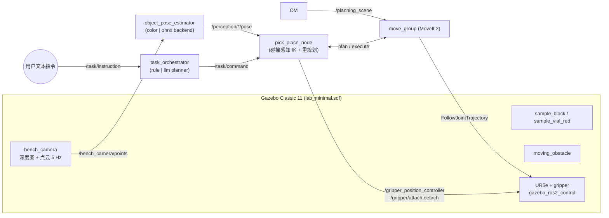

# robot_lab_demo

这是一个面向“实验室智能管理协作机器人”场景的 ROS 2 仿真演示项目。项目基于已安装的 Universal Robots ROS 2 软件包，组合了 UR5e 机械臂、双指平行夹爪、Gazebo 实验室环境、RGB-D 感知节点、MoveIt 2 规划与任务执行节点，用于演示从环境感知到抓取、搬运、放置的完整流程。

当前主线支持 Ubuntu 22.04 + ROS 2 Humble + Gazebo Classic 11。项目也保留了一个麦克纳姆移动底盘变体，但固定底座 UR5e + 夹爪方案是当前更稳定的演示路径。

## 系统架构



## 功能概览

- Gazebo Classic 11 实验室世界：包含实验台、样品块、红色试管瓶、托盘、工具架、目标垫和动态障碍物。
- 机器人模型：`lab_ur_gripper.urdf.xacro` 描述了安装在 0.76 m 立柱上的 UR5e 机械臂和双指平行夹爪，并通过 `gazebo_ros2_control` 接入控制器。
- RGB-D 相机：Gazebo 通过 `libgazebo_ros_camera.so` 发布 `/bench_camera/image`、`/bench_camera/depth/*` 和 `/bench_camera/points`。
- MoveIt 2：启动 `move_group`，使用 Universal Robots 的规划配置，并通过项目 SRDF 添加夹爪语义。
- RViz：提供稳定版视图和 MoveIt 规划界面视图。
- `scripted_pick_demo`：执行完整抓取流程，包括打开夹爪、接近、下降、闭合夹爪、吸附、抬升、搬运、放置、释放和撤离。
- `preset_joint_demo`：执行关节空间冒烟测试动作，用于快速确认控制链路是否正常。
- `robot_lab_perception`：基于颜色/点云检测目标物体，发布 6D 位姿、RViz Marker 和 JSON 检测摘要。
- `robot_lab_tasks`：负责文本指令分解、抓取放置执行、动态障碍物同步和评估脚本。

## 文本指令示例

启动演示后，可以向 `/task/instruction` 发布中文或英文任务指令：

```bash
ros2 topic pub --once /task/instruction std_msgs/msg/String "{data: '把样品块放到目标垫'}"
ros2 topic pub --once /task/instruction std_msgs/msg/String "{data: '先把试管瓶放到托盘，然后把样品块放到中间'}"
```

当前规则解析器支持的常见词汇：

- 物体：样品块、方块、block、试管瓶、瓶、vial
- 目标：目标垫、垫、pad、托盘、tray、中间、center

任务规划和执行进度会发布到 `/task/plan` 和 `/task/status`。

## 评估脚本

```bash
# 感知精度评估，写入 results/perception_eval.csv
ros2 run robot_lab_perception evaluate_perception --ros-args -p trials:=20

# 抓取放置成功率评估，写入 results/pick_place_eval.csv
ros2 run robot_lab_tasks evaluate_pick_place.py --ros-args -p trials:=5

# 带动态障碍物干扰的抓取放置评估
ros2 run robot_lab_tasks evaluate_pick_place.py --ros-args -p trials:=3 -p sweep_obstacle:=true
```

当前基线结果（WSL2、无头运行）：

- 感知：20/20 检测成功，成功率 100%，平均平面误差 2.5 mm，最大误差 5.8 mm。
- 抓取放置：无障碍干扰 5/5 成功；动态障碍物干扰下 3/3 成功，并触发中止-重规划重试。
- 障碍物位姿到 MoveIt 规划场景延迟：平均 0.32 ms，最大 1.68 ms，记录在 `results/obstacle_latency.csv`。

## 构建

```bash
cd /home/THW22/projects/robot_lab_demo
source /opt/ros/humble/setup.bash
colcon build --symlink-install
source install/setup.bash
```

## 启动固定底座 UR5e 演示

```bash
ros2 launch robot_lab_bringup lab_ur_moveit_gz.launch.py
```

默认启动配置面向 WSLg 稳定运行：Gazebo 以无头模式运行，RViz 使用轻量级 `robot_lab_stable.rviz` 视图，感知节点和任务节点默认关闭。

常用启动参数：

```bash
ros2 launch robot_lab_bringup lab_ur_moveit_gz.launch.py ur_type:=ur5e
ros2 launch robot_lab_bringup lab_ur_moveit_gz.launch.py gazebo_gui:=false launch_rviz:=false
ros2 launch robot_lab_bringup lab_ur_moveit_gz.launch.py auto_start_task:=true
ros2 launch robot_lab_bringup lab_ur_moveit_gz.launch.py rviz_profile:=moveit
ros2 launch robot_lab_bringup lab_ur_moveit_gz.launch.py render_mode:=gpu
ros2 launch robot_lab_bringup lab_ur_moveit_gz.launch.py qt_gl_integration:=xcb_glx
ros2 launch robot_lab_bringup lab_ur_moveit_gz.launch.py window_backend:=wayland
```

在 WSLg 中建议保持 Gazebo GUI 关闭，先用稳定配置确认链路：

```bash
ros2 launch robot_lab_bringup lab_ur_moveit_gz.launch.py \
  gazebo_gui:=false launch_rviz:=true rviz_profile:=stable \
  launch_tasks:=false launch_perception:=false
```

启动文件默认使用 WSLg 下较稳定的软件 OpenGL 路径：

```text
QT_QPA_PLATFORM=xcb
QT_OPENGL=software
LIBGL_ALWAYS_SOFTWARE=1
QT_X11_NO_MITSHM=1
```

如果软件渲染过慢，可以尝试 `render_mode:=gpu` 切换到 Mesa D3D12 加速路径。若 GPU 渲染闪烁，可比较 `qt_gl_integration:=xcb_egl` 与 `qt_gl_integration:=xcb_glx`，或者安装 `qtwayland5` 后尝试 `window_backend:=wayland`。

## 运行任务节点

在演示启动后，打开第二个终端：

```bash
cd /home/THW22/projects/robot_lab_demo
source /opt/ros/humble/setup.bash
source install/setup.bash

# 完整抓取循环：抓取样品块并放到目标垫
ros2 run robot_lab_tasks scripted_pick_demo

# 关节空间冒烟测试，不涉及夹爪交互
ros2 run robot_lab_tasks preset_joint_demo
```

两个节点都会使用 MoveIt group `ur_manipulator`，添加 `lab_table` 碰撞物体，通过 `move_group` 规划，并在 `joint_trajectory_controller` 上执行。抓取节点还会通过 `/gripper_position_controller/commands` 控制夹爪。

## 快速验证命令

```bash
ros2 control list_controllers
ros2 action list | grep follow_joint_trajectory
ros2 node list | grep move_group
ros2 pkg list | grep robot_lab
```

控制器期望状态：

```text
joint_state_broadcaster active
joint_trajectory_controller active
gripper_position_controller active
```

## 主要文件

```text
src/robot_lab_description/worlds/lab_minimal.sdf
src/robot_lab_description/urdf/lab_ur_gripper.urdf.xacro
src/robot_lab_description/urdf/inc/parallel_gripper_macro.xacro
src/robot_lab_description/srdf/lab_ur_gripper.srdf.xacro
src/robot_lab_bringup/config/lab_ur_controllers.yaml
src/robot_lab_bringup/config/robot_lab_moveit.rviz
src/robot_lab_bringup/config/robot_lab_stable.rviz
src/robot_lab_bringup/launch/lab_ur_moveit_gz.launch.py
src/robot_lab_bringup/scripts/recenter_rviz_window.py
src/robot_lab_bringup/scripts/static_lab_scene_markers.py
src/robot_lab_perception/robot_lab_perception/object_pose_estimator.py
src/robot_lab_perception/robot_lab_perception/detector_backends.py
src/robot_lab_perception/robot_lab_perception/evaluate_perception.py
src/robot_lab_tasks/src/pick_place_node.cpp
src/robot_lab_tasks/src/scripted_pick_demo.cpp
src/robot_lab_tasks/src/preset_joint_demo.cpp
src/robot_lab_tasks/scripts/task_orchestrator.py
src/robot_lab_tasks/scripts/obstacle_monitor.py
src/robot_lab_tasks/scripts/evaluate_pick_place.py
tests/test_project_structure.py
tests/test_preset_joint_demo_preflight.py
```

## 麦克纳姆移动底盘变体

`lab_ur_mecanum_gz.launch.py` 保留了原始 Gazebo Sim / `ros_gz` 移动底盘方案。它不是当前 Humble + Gazebo Classic 冒烟测试的主路径。当前推荐优先使用固定底座 UR5e 夹爪演示。

```bash
ros2 launch robot_lab_bringup lab_ur_mecanum_gz.launch.py

# 全向底盘遥控：前进 + 横移 + 旋转
ros2 topic pub -r 10 /cmd_vel geometry_msgs/msg/Twist "{linear: {x: 0.3, y: 0.2}, angular: {z: 0.1}}"

# 查看里程计
ros2 topic echo /odom
```

已验证：纯横移指令可以让底盘侧向运动，前向漂移约为 0，符合麦克纳姆轮特征；移动平台上的机械臂控制器保持 active。后续可扩展方向是 station_b 自主导航、odom/world TF 连接，以及任务层底盘移动 action。

## 当前限制

- 固定底座 UR5e 演示已经迁移到 Humble + Gazebo Classic。
- 麦克纳姆移动底盘变体和 Gazebo Sim 的 attach/detach 抓取插件仍偏向 Jazzy/Gazebo Sim，需要单独迁移到 Classic。
- Gazebo Classic 没有 Gazebo Sim 中同样的 `DetachableJoint` system，因此 Classic 冒烟路径暂未启用真实物体附着插件。
- 如果 Gazebo/RViz 在 WSLg 下较慢，建议使用 `gazebo_gui:=false launch_rviz:=false` 做无头验证。

## 常见问题

如果 `preset_joint_demo` 提示缺少 `robot_description` 或 `/joint_states`，说明 bringup launch 还没有运行。请先启动完整演示，等待 MoveIt 打印 `You can start planning now!`，再在第二个终端运行任务节点。

单终端冒烟测试可以使用：

```bash
ros2 launch robot_lab_bringup lab_ur_moveit_gz.launch.py auto_start_task:=true
```

如果 Gazebo 或 RViz 在 WSLg 下出现空白或闪烁的 3D 窗口，优先保持启动文件中的软件 OpenGL 默认值。可用下面的命令手动检查加速渲染路径：

```bash
GALLIUM_DRIVER=d3d12 glxinfo -B
```

加速渲染通常会显示 `D3D12`；稳定的软件路径可能显示 `llvmpipe`。如果 RViz 正常但 Gazebo GUI 仍为空白，可以保持 `gazebo_gui:=false launch_rviz:=true`，仿真仍会在 Gazebo 中运行，RViz 负责显示机器人、关节状态和 MoveIt 规划界面。

如果 `ros2 launch` 找不到本地包，请重新构建并 source 当前工作区：

```bash
cd /home/THW22/projects/robot_lab_demo
source /opt/ros/humble/setup.bash
colcon build --symlink-install
source install/setup.bash
```
